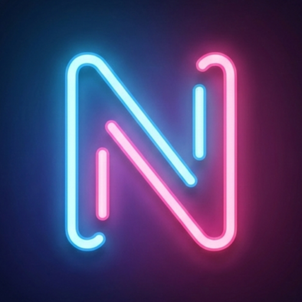
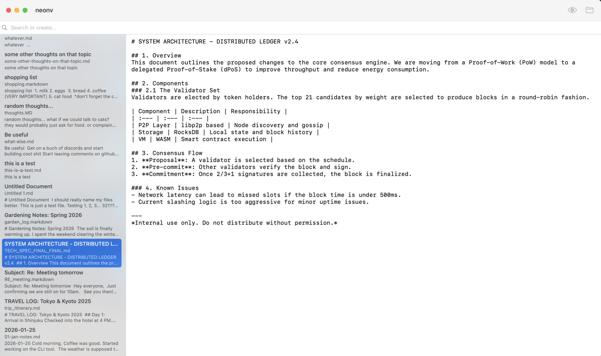
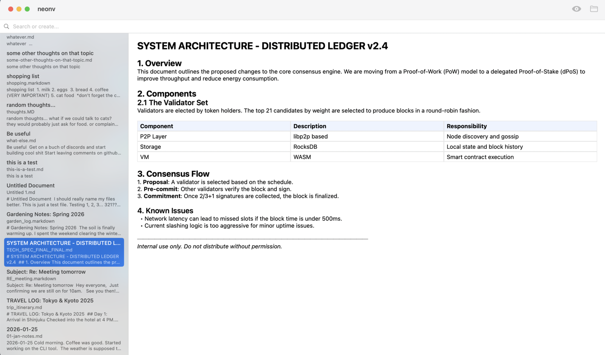
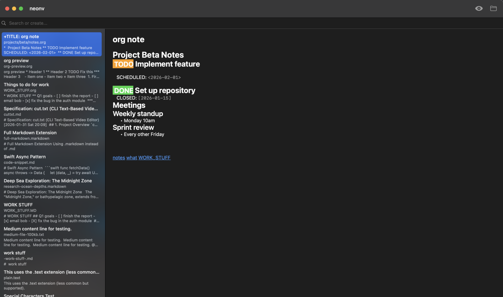
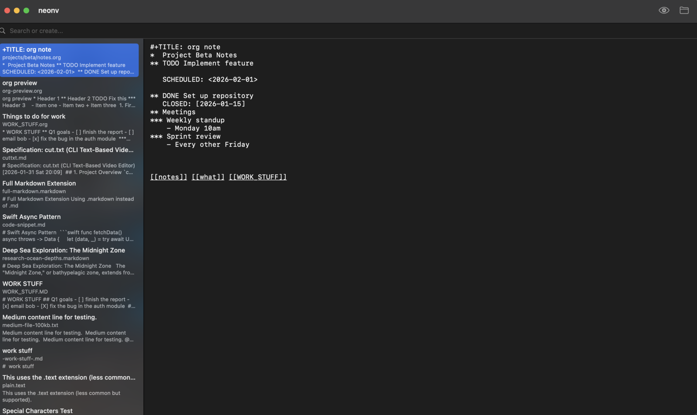
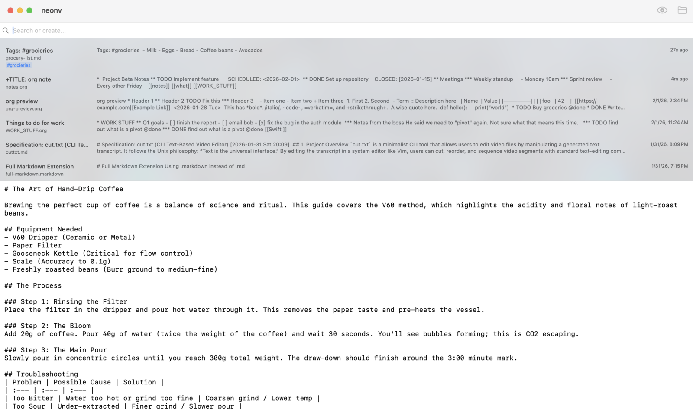

# neonv

A minimal, low friction text capture tool with Markdown preview for macOS. Store snippets, thoughts, notes, and random text, find them instantly, never think about saving.

Inspired by [Notational Velocity](https://notational.net/)'s speed and simplicity, with a few extra features to modernize it (.org support, Markdown preview, open in external editor).

Yes, it's mostly AI coded. This was built partially because it was something I wanted, and partially as an excuse to learn and experiment with AI coding tools, and trying to find a viable way to use them to build what I hope is high quality software.

Bug reports and feature requests are accepted, preferably in the form of a coding agent prompt. As of Feb 2026 I consider this project essentially feature-complete. -Matt

## Features

- Auto-saves continuously.
- Fuzzy full-text search as you type. 
- Files are plain `.txt`, `.md`, or `.org`. No databases.
- CMD-G to open in external editor. Neonv is focused on text capture and search, it isn't a replacement for your full-featured text editor.
- Wiki-style `[[target]]` and `[[target|label]]` links in editor and preview. Cmd-click opens links.

## Screenshots

Mac app icon:

<a href="img/neonv-mac-icon.png">
  
</a>

### Light Theme



### Markdown Preview



### Org Mode Preview



### Org Mode Editing



### Tags And Vertical Layout



## Installation

### Homebrew (Recommended)

```bash
brew install --cask msnodderly/tap/neonv
```

### Manual Download

1. Download the latest DMG from [GitHub Releases](https://github.com/msnodderly/neonv/releases)
2. Open the DMG and drag NeoNV to Applications
3. **First launch (app is unsigned):**
   - Double-click NeoNV — macOS will block it
   - Open **System Settings → Privacy & Security**
   - Scroll to **Security**, click **"Open Anyway"**

## Building from Source

Open `NeoNV.xcodeproj` in Xcode 15+ and build (⌘B).

```bash
xcodebuild -scheme NeoNV -configuration Release
```

## License
This repo contains no code from Notational Velocity but is heavily inspired by it and as such it's released under the same license.

NeoNV is free software licensed under the [GNU General Public License v3.0](LICENSE).
